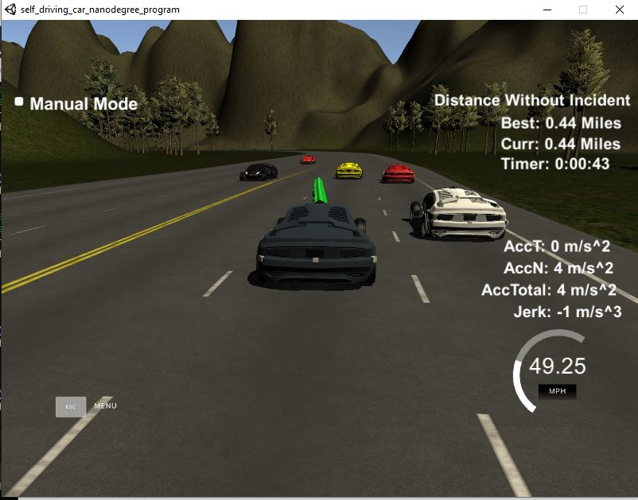
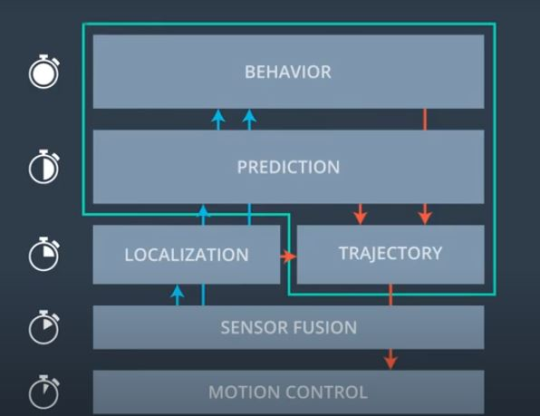
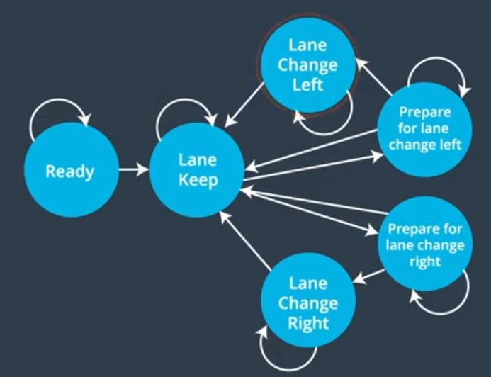
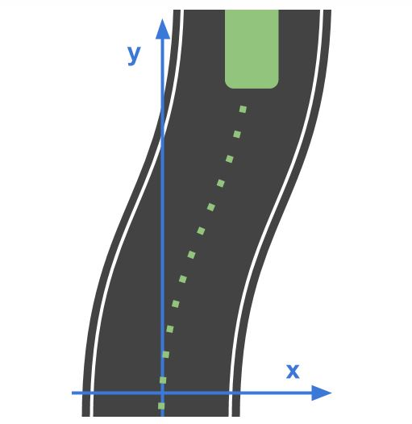
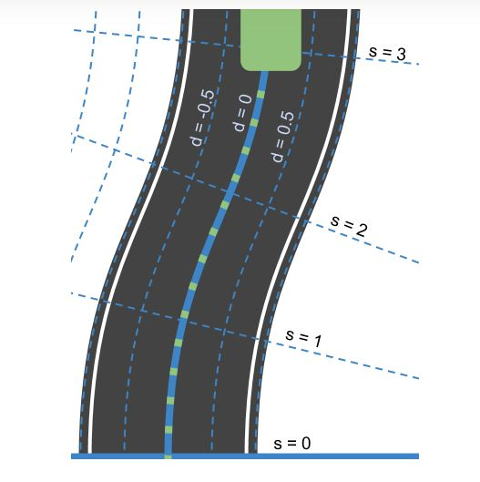
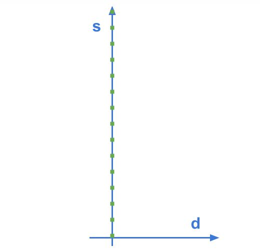
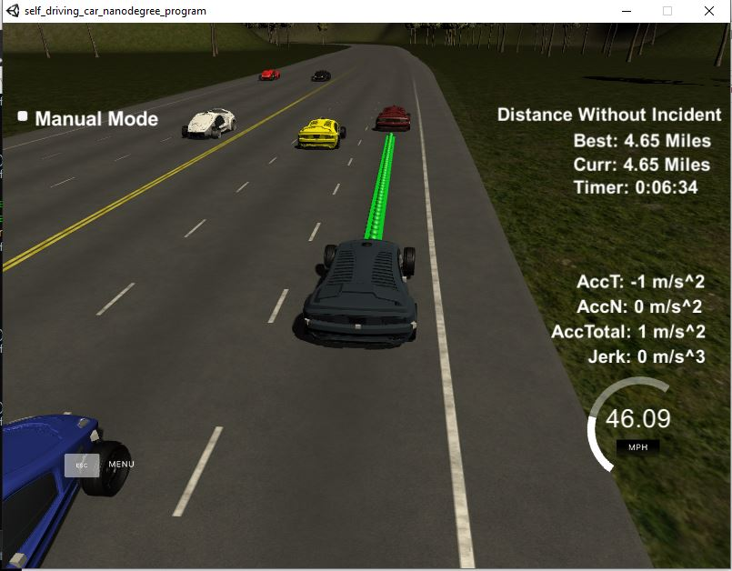

# Highway Driving

[](http://www.udacity.com/drive)
   


<h2> Overview </h2>
<p>  The project focusses on path planning for the self driving car in Highways. The project uses sensor fusion to get the data about its surrounding vehicles. A behivour planner is used to estimate the best state at any given time based on the sensor fusion data, car's position and map's data. It uses a finite state machine to find out the next state based on the particular behaviour. The trajectory generator generates various trajectories at a given time based on the state output of the behaviour planner and uses a cost function to select the best trajectory at a given time. The output of the trajectory planner is given to motion control system to implement the trajectory. Here we assume that the car implements the behavior without any error as given by the output of the trajectory planner (like the car moves 10m forward if planner sent that without any error), so we don't use a controller here.</p>



<h2> Finite State Machine </h2>



<p> The behavioural planner uses Finite state machine to find out the next state based on the current state and measurmenets from sensors.The ready state is the initial state where the car starts from rest and reaches the desired speed limit. The speed limit for the project is 50 mph. To avoid jerk we set the limit the change in acceleration to be less than 10m/s. (here we use 5m/s). So when car is in ready state it acclerates to the speed if (49.5mph in this case) and moves to lane keep state. </p>

<p> Now if the car finds any car preceding it, it goes to prepare lane change state. It first goes to prepare lane change left state where it uses the sensor fusion data to find out the cars in the left lane. It interpolates the current position of the other car by multiplying the car's position with the frame rate (0.02s) and the points our car has pending from the current state before making the lane shift to get the new position of the other car in the left lane. If the value is greater than 30m then it gives a green flag for lane chaning.</p>

<p> The same is repeated for prepare for lane change right state. The keep lane state first checks whether lane chaning is feasible for left lane and then right lane. If any one lane change maneuver is feasible then it moves to that particular lane change left or lane change right state. If both lanes are free then we apply a cost function based on the number of cars detected by the sensor fusion in the particular lane and shift to the lane with lesser number of cars.</p>

<h2> Behavioural planner </h2> 

<h4> Psuedo code </h4>

```
Initialized Max Speed to let say 49.5
Initialized Acceleration to .224 (5m/s)
IF Car Ahead 
   Reduce Acceleration
   
	IF there is NO car on the left lane AND ego car is NOT on the left lane
		Change lane to left
	ELSE IF there is NO car on the right lane AND ego car is NOT on the right lane
		Change lane to right
	
		
ELSE
   IF Reference Velocity is LESS THAN Max Speed
	   Increase Acceleration
    
	IF ego car is NOT on the center lane
		IF ego car is on the left lane AND there is NO car on the right    OR    ego car is on the right lane AND     there is NO car on the left
			Go back to the center lane

   
```

<p> The behavioural planner is implemented based on the above psuedo code. After the car is set to the desired state from rest, it checks whether any car is ahead of it or not. If so then it prepares for lane change based on the FSM above and moves to corresponding lane. If both the left and right lanes are occupied then the our car is deacclerated until we are in safe distace from the car ahead (30m).</p>

<p> If there is no car ahead of us we check whether our ego car is in center lane and our car drives in reference speed of 49.5 mph. If the speed is less we accelerate and if the car is not in center lane but in left lane we check our right lane and move to right if it is free and vice versa.</p>


<h2> Frenet Coordinates </h2>

<p> The planner uses frenet coordinate system to estimate the vehicles around it and to compute the trajectory. The main advantage of using frenet is that it gives linear function even for curvy roads. The cartesian coordinate system for the road of below kind gives a quadratic equation.</p>



<p> But the frenet coordinates gives a direct straight line  as below.</p>



<p>The d parameter in frenet coordinate system corresponds to the lanes width or  lateral displacement. The center yellow lane is marked as 0 in the project, the left lanes are numbered positive and right are negative. The lane width used in the project os of 4m and our car is in the center. The s parameter is denotes the longitudinal displacement which represents distance along the road.</p>

<h2>Trajectory Generation </h2>

<h3> Curve fitting with spline </h3>

<p>The trajectory generation module uses spline library of c++ to provide polynomial fitting for the points. The main advantage of spline library is that it generates smooth trajectory even in curved roads. Now to provide smooth traversal from one state to another, we use the previous state values and fill the array for new states only for those points which are travelled in the previous state. We keep an array of size 50 for this purpose. First if the previous state array is empty we fill the present car coordinates and we find out the previous coordinate by subtracting the cosing and sine of yaw angle. If the array has values we take only the last 2 elements for generating the next state points. </p>

<p> We then interpolate the previous points with the last measured car's s value incremented by 30,60 and 90 to generate the next trajectory using spline function. Before we pass to spline we just transform all the 5 new points to last measured car's point space to make the yaw angles 0.</p>

<h3> Generation of trajectory </h3>

<p>Now we generate the trajectory for a distance ahead of 30m. We divide the space with N points based on based on the hypotenuse of the x,y points and finally transform the points in reverse as before and store in the array of previously untraversed points to ensure smoother transition.</p>

<h2> Simulator details </h2>

Main car's localization Data (No Noise)
["x"] The car's x position in map coordinates

["y"] The car's y position in map coordinates

["s"] The car's s position in frenet coordinates

["d"] The car's d position in frenet coordinates

["yaw"] The car's yaw angle in the map

["speed"] The car's speed in MPH

Previous path data given to the Planner
//Note: Return the previous list but with processed points removed, can be a nice tool to show how far along the path has processed since last time.

["previous_path_x"] The previous list of x points previously given to the simulator

["previous_path_y"] The previous list of y points previously given to the simulator

Previous path's end s and d values
["end_path_s"] The previous list's last point's frenet s value

["end_path_d"] The previous list's last point's frenet d value

Sensor Fusion Data, a list of all other car's attributes on the same side of the road. (No Noise)
["sensor_fusion"] A 2d vector of cars and then that car's [car's unique ID, car's x position in map coordinates, car's y position in map coordinates, car's x velocity in m/s, car's y velocity in m/s, car's s position in frenet coordinates, car's d position in frenet coordinates.

Details
The car uses a perfect controller and will visit every (x,y) point it recieves in the list every .02 seconds. The units for the (x,y) points are in meters and the spacing of the points determines the speed of the car. The vector going from a point to the next point in the list dictates the angle of the car. Acceleration both in the tangential and normal directions is measured along with the jerk, the rate of change of total Acceleration. 

There will be some latency between the simulator running and the path planner returning a path, with optimized code usually its not very long maybe just 1-3 time steps. During this delay the simulator will continue using points that it was last given, because of this its a good idea to store the last points you have used so you can have a smooth transition. previous_path_x, and previous_path_y can be helpful for this transition since they show the last points given to the simulator controller with the processed points already removed.

<h2> Execution </h2>

```
Simulation link: github.com/udacity/self-driving-car-sim/releases/tag/T3_v1.2
Make a build directory: mkdir build && cd build
Compile: cmake .. && make
Run it: ./path_planning.

```

<h2>Output</h2>


<p> The car has travelled 4.23 miles  (one lap around the entire simulation) without any incident.</p>
